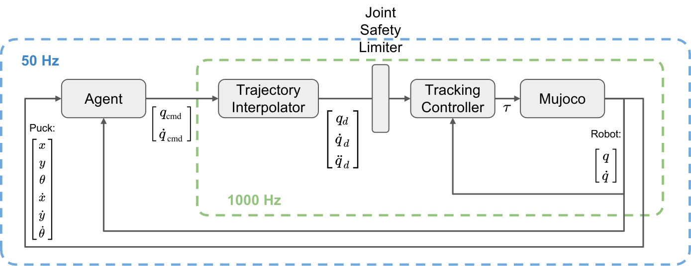
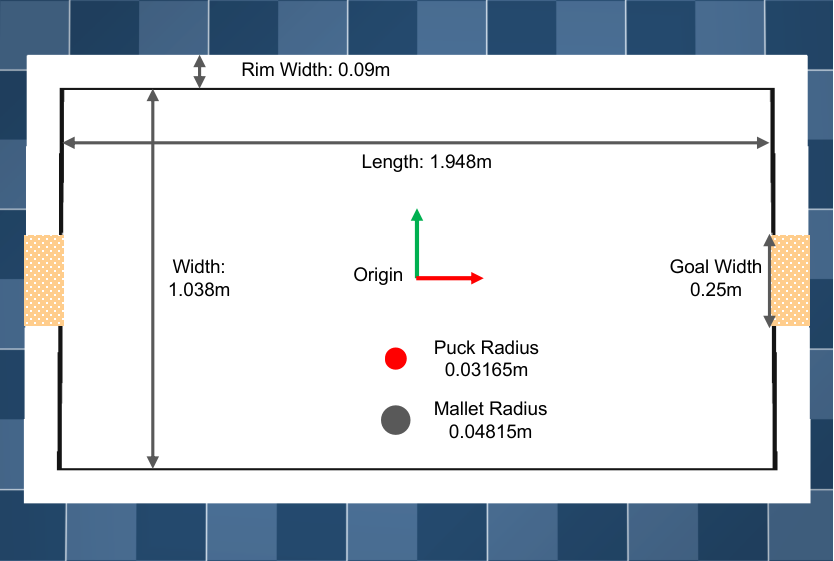
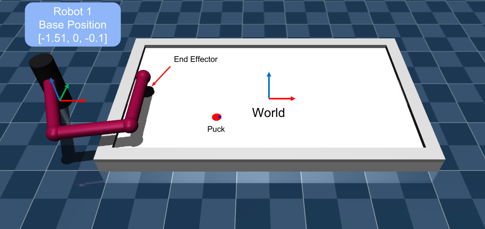
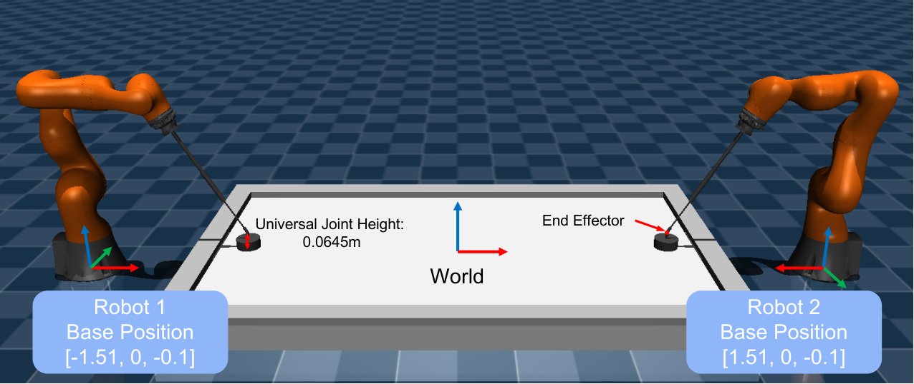

.. _environments:

Environments
============

General Concept
---------------

``AirHockeyChallengeWrapper`` is a wrapper of the ``base_env`` and will process the
necessary information for the challenge evaluation.

We try to make the simulated environment close to the real-world setup. The robot is
controlled by a ``TrackingController``, a Feedforward-PD Controller, which sends the
torque command :math:`\tau_{cmd}` to the robot

.. math::

    \tau _{\mathrm{cmd}} = M(q)\ddot{q}_{d} + c(q, \dot{q}) + g(q) + K_p( q_{d} - q) + K_d
    (\dot{q}_{d} - \dot{q})

A ``TrajectoryInterpolator``, cubic polynomial, is used to interpolate the trajectory
points between two consecutive commands. To avoid the interpolator generating irrational
set points, i.e., the command exceeds the position or velocity limits, we also modify the
set point :math:`q_d, \dot{q}_d` by a ``JointSafetyLimiter``, following
`Joint Safety Limits <http://wiki.ros.org/pr2_controller_manager/safety_limits>`_.

Specification of the Environment
--------------------------------

Here we list all important specifications about the environment:

.. list-table::
   :widths: 30 50
   :header-rows: 0

   * - **Simulation Frequency**
     - 1000 Hz
   * - **Control Frequency**
     - 50Hz
   * - **Observation**
     - Puck's X-Y Position, Yaw Angle: :math:`[x, y, \theta]`
   * -
     - Puck's Velocity: :math:`[\dot{x}, \dot{y}, \dot{\theta}]`
   * -
     - Joint Position / Velocity: :math:`[q, \dot{q}]`
   * -
     - Opponent's Mallet Position (if applicable): :math:`[x_o, y_o]`
   * - **Control Command**
     - Desired Joint Position / Velocity
   * - **Available Environments**
     - **Warm Up**: ``3dof-hit``, ``3dof-defend``
   * -
     - **Qualifying**: ``7dof``, ``7dof-hit``, ``7dof-defend``, ``7dof-prepare``
   * -
     - **Tournament**: ``tournament``

Air Hockey Table
~~~~~~~~~~~~~~~~

The dimensions of the Table, Puck and Mallet are specified in the following figure.

Planar Robot - 3DoF
~~~~~~~~~~~~~~~~~~~

The base of the planar robot is located at [-1.51, 0., -0.1], the orientation is
aligned with the world's frame.

KUKA iiwa14 LBR Robot
~~~~~~~~~~~~~~~~~~~~~

For the KUKA robot, we add a universal joint on the end-effector to increase the
robot's flexibility. The universal joint is a passive joint that will adapt the
joint position based on contacts. In the simulation, we use a plugin to compute the
joint's angle to keep the mallet vertical. The position of the universal joint
is not observed.

We define the End-Effector as the tip of the extension rod before the universal
joint. The end-effector's position can be fully determined by the robot's
joint position and forward kinematics. The base position of the robot is depicted in the
Figure.

Environment Construction
------------------------

You can construct the environment by

.. code-block:: python

    from air_hockey_challenge.framework import AirHockeyChallengeWrapper

    # Available Environments [3dof, 3dof-hit, 3dof-defend],
    # [7dof, 7dof-hit, 7dof-defend, 7dof-prepare, tournament] will be released at the beginning of
    # the stage.
    env = AirHockeyChallengeWrapper("3dof-hit")

    print(env.env_info)

.. _env_info:

env_info
--------

The environment's information is specified in a nested dictionary ``env_info``. ``env_info``
is passed to the ``AgentBase`` constructor. Here we provide a quick reference table for
convenience.

.. code-block:: python

    env_info = {
        "env_name": str,                        # Name fo the environment
        "n_agents": 1,                          # Number of Agents, [1, 2]
        "dt": 0.02,                             # Delta time between two control signal
        "puck_pos_ids": list(int),              # Observation's indices the puck's position
        "puck_vel_ids": list(int),              # Observation's indices the puck's velocity
        "joint_pos_ids": list(int),             # Observation's indices the robot joint position
        "joint_vel_ids": list(int),             # Observation's indices the robot joint velocity
        "opponent_ee_ids": list(int),           # Observation's indices the opponent's ee position (if applicable)

        'rl_info': mushroom_rl.MDPInfo          # Object contains information for RL algorithms in MushroomRL

        "table": {
            "length": 1.948,
            "width": 1.038,
            "goal_width": 0.25,
            },

        "puck": {
            "radius": 0.03165,
            },

        "mallet": {
            "radius": 0.04815,
            },

        # Specifications of the Robot
        "robot": {
            "n_joints": 3,                      # Number of robot's joint, [3, 7]
            "base_frame": list(ndarray(4, 4)),  # The transformation matrix of the base frames
            "ee_desired_height": 0.1,           # The height of the end-effector w.r.t base frame
            "joint_pos_limit": ndarray(2, N),   # The lower and upper limits of joint position
            "joint_vel_limit": ndarray(2, N),   # The lower and upper limits of joint velocity
            "joint_acc_limit": ndarray(2, N),   # The lower and upper limits of joint acceleration
            "control_frequency": 50,

            "robot_model": mujoco.mjModel,      # The mjModel object of the robot only model. For kinematics computation
            "robot_data": mujoco.mjData,        # The mjData data of the robot only model. For kinematics computation
            }

        'constraints': ConstraintList           # An object for the constraints computation
    }