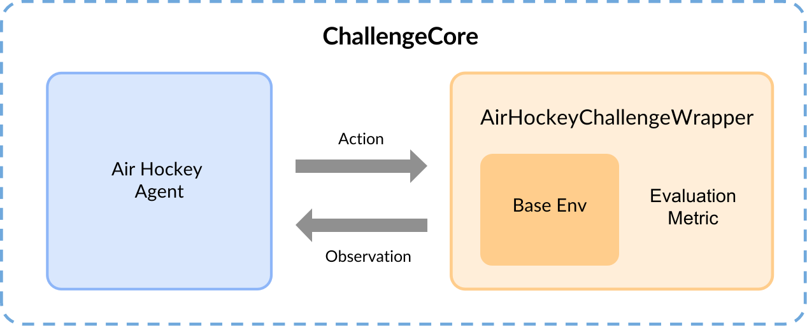

.. _framework:

===================
Challenge Framework
===================

The Air Hockey Challenge is built upon `MushroomRL <https://mushroomrl.readthedocs.io/en/latest/?badge=latest>`_, a
Reinforcement Learning Library. The general framework of challenge consists of two key components, i.e., ``Agent``
and ``AirHockeyChallengeWrapper``.

You should modify the ``air_hockey_agent/agent_builder.py`` to develop ``[YOUR AGENT]`` that interacts with the
``AirHockeyChallengeWrapper``.

.. _dummy_agent:

Example: DummyAgent
--------------------

We build up a ``DummyAgent`` as a first example. The agent will hold static at its initial position.

.. literalinclude:: examples/dummy_agent_example.py

``AgentBase`` is a base class that provides several util functions to get specific observation. Further details can be
found in :ref:`Agent <agent>`.

``env_info`` is a dictionary contains all of the necessary information about the environment.
Further details about can be found in :ref:`env_info`.

Two functions are necessary in the ChallengeCore ``reset`` and ``draw_action``. ``reset`` is called at the beginning
of each episode. At each step, ``draw_action`` should return an ndarray of shape [2, number_of_joints] consisting of
the **[Desired Position]** and **[Desire Velocity]**.

You also need to implement the function ``build_agent`` which returns an object of your agent.

.. _run:

Run
---

You can check available arguments of ``run.py`` by

.. code-block:: console

    $ python run.py -h

To start the evaluation locally

.. code-block:: console

    $ python run.py -r -e 3dof-hit --n_cores 1 --n_episodes 1

Note that in the remote evaluation, you need to put agent related arguments in ``air_hockey_agent/agent_config.yml``.
The evaluation related arguments will be overwritten.