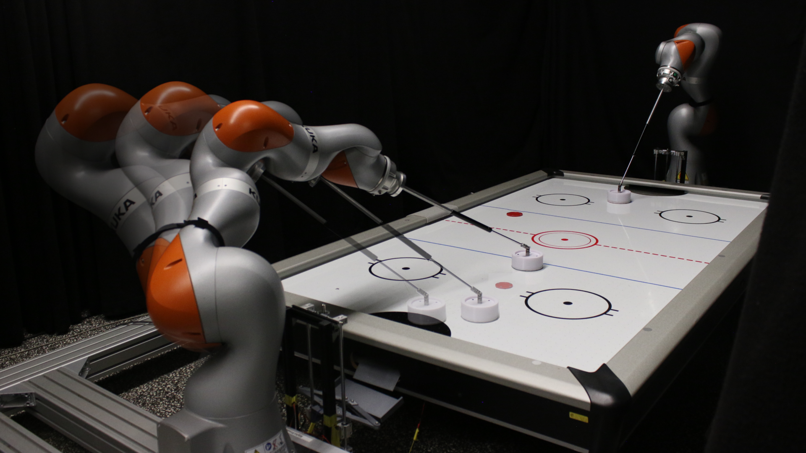

Documentation for Robot Air Hockey Challenge
============================================

`Robot Air Hockey Challenge <https://air-hockey-challenge.robot-learning.net>`_ provides a platform for researchers in
the field of robot learning to interact with each other on a realistic robotic task. In this competition, teams will
design and build their air hockey agents, competing against each other in different subtasks (in simulation) and
finally in an entire game (both in simulation and in the real world).

The main part of the challenge consists of three simulated stages:
:ref:`Warm Up <warm_up>`, :ref:`Qualifying <qualifying>`, and :ref:`Tournament <tournament>`.
Each stage consists of different tasks required for robot air hockey. Besides preparing your agents for executing the
desired movements in the environments that are provided to you, they should also be robust and capable to adapt to
environmental changes. Finally, the top three teams will be able to deploy their agent on the real robot.

.. list-table:: Environment Description
   :widths: 10 25 25 25
   :header-rows: 1

   * - Stage
     - Robot
     - Tasks
     - Evaluation
   * - :ref:`Warm Up <warm_up>`
     - 3-DoF Planar Robot
     - Hit, Defend
     - Ideal Simulator
   * - :ref:`Qualifying <qualifying>`
     - KUKA iiwa14 LBR
     - Hit, Defend, Prepare
     - Realistic Simulator
   * - :ref:`Tournament <tournament>`
     - KUKA iiwa14 LBR
     - Competition
     - Realistic Simulator
   * - Real Robot Validation
     - KUKA iiwa14 LBR
     - Competition
     - Real Robot

The goal of this document is to provide a basic introduction to the challenge's library, including
:ref:`Installation <installation>`, :ref:`Challenge Framework <framework>`, :ref:`environments`, :ref:`Agent <agent>`,
:ref:`Evaluation <evaluation>`, :ref:`Constraints <Constraints>`, and :ref:`submission`.

For information about general rules, such as, registration and important dates,
please see the `challenge website <https://https://sites.google.com/view/rahc-2023>`_.

Contents
--------

.. toctree::
    :maxdepth: 2

    getting_started
    warm_up
    qualifying
    tournament
    api
