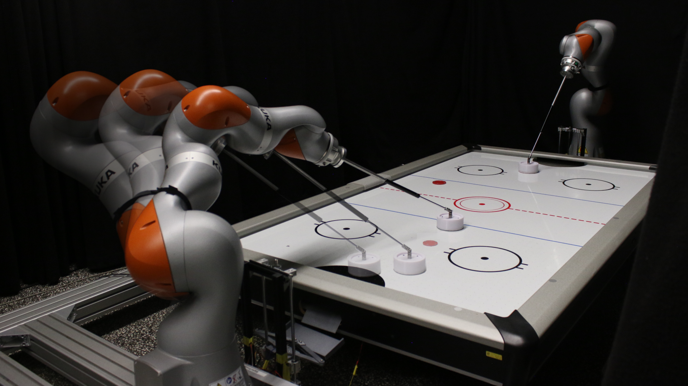

Documentation for Robot Air Hockey Challenge
============================================

`Robot Air Hockey Challenge <https://air-hockey-challenge.robot-learning.net>`_ provides a platform for researchers in
the field of robot learning to interact with each other on a realistic robotic task. In this competition, teams will
design and build their air hockey agents, competing against each other in an entire game.

The documentation will be made available when the challenge starts (15. August 2025).
