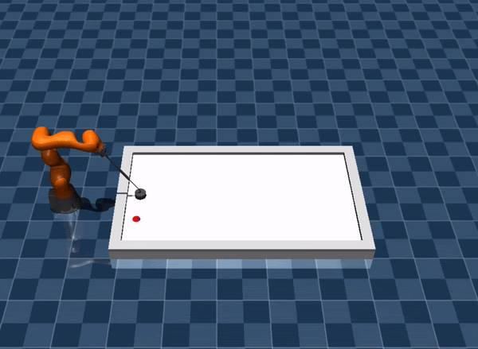

.. _qualifying:

Qualifying
==========

In this stage, you will solve the three main subtasks with a 7dof KUKA IIWA robot. In the simulation, the collision
between the robot and the table are disabled. Thus your solution must keep the mallet (Robot's End Effector)
at an appropriate height.

.. note::
   During this phase, we will make different modifications in the environment to simulate real-world challenges.
   Participants will develop their robotic agents in an ideal environment. In order to deal with theses challenges,
   we encourage the participant to submit their agent, collect the dataset and improve the robustness of your agent.

Installation
------------
1. If you did not join the **warm-up** stage, you can finish the :ref:`Installation <installation>` instruction.

2. If you have already cloned the repo, you can checkout to the ``qualifying`` branch and merge your local changes.

Environment Specifications
--------------------------
Here we list the some useful information about the environment.

.. important::
    In the constraint, the joint position and velocity limits for constraint computation
    is 95% of the actual limits. For example, the upper bound of the position limit for
    joint 1 is 2.967. In the ``Evaluation`` and ``Constraints``, we check if the joint
    position exceeds 2.967 * 0.95 = 2.818707.

+-----------------------------------------+---------------------------------------------------------------------+
| **Robot Specifications**                |                                                                     |
+-----------------------------------------+---------------------------------------------------------------------+
| Robot Position Upper Limit (rad)        | [ 2.967,  2.09 ,  2.967,  2.094,  2.967,  2.094, 3.054]             |
+-----------------------------------------+---------------------------------------------------------------------+
| Robot Position Lower Limit (rad)        | [-2.967, -2.094, -2.967, -2.094, -2.967, -2.094, -3.054]            |
+-----------------------------------------+---------------------------------------------------------------------+
| Robot Velocity Limit (rad/s)            | +/- [ 1.483,  1.483,  1.745,  1.308,  2.268, 2.356,  2.356]         |
+-----------------------------------------+---------------------------------------------------------------------+
| **Environment Specifications**          |                                                                     |
+-----------------------------------------+---------------------------------------------------------------------+
| Environments                            | ``7dof-hit``, ``7dof-defend``, ``7dof-prepare``                     |
+-----------------------------------------+---------------------------------------------------------------------+
| Initial Robot Position (fixed)          | [ 0, -0.1960, 0, -1.8436, 0, 0.9704  0]                             |
+-----------------------------------------+---------------------------------------------------------------------+
| Initial Robot Velocity                  | 0                                                                   |
+-----------------------------------------+---------------------------------------------------------------------+

**Hit**: ``7dof-hit``
~~~~~~~~~~~~~~~~~~~~~

In this task, the opponent moves in a predictable pattern. The puck is initialized randomly
with a small velocity. The task is to hit the puck to the opponent's goal.

.. image:: ../assets/7dof-hit.gif
  :width: 400

**Initialization Range**:

.. list-table::
   :widths: 20 49
   :header-rows: 0
   :align: center

   * - :math:`x`
     - [0.81, 1.31]
   * - :math:`y`
     - [-0.39, 0.39]
   * - linear speed (m/s)
     - [0, 0.5]
   * - angular speed (rad/s)
     - [-2, 2]

**Termination Criterion**: The puck is bounced back or scored.

**Success Criterion**: The puck is in opponent's goal when the episode terminates.

----

**Defend**: ``7dof-defend``
~~~~~~~~~~~~~~~~~~~~~~~~~~~

The puck is randomly initialized on the right side of the table with a random velocity heading left.
The objective is to stop the puck on the right side of the table and prevent it from getting scored.

**Initialization Range**:

.. list-table::
   :widths: 20 49
   :header-rows: 0
   :align: center

   * - :math:`x`
     - [1.80, 2.16]
   * - :math:`y`
     - [-0.4, 0.4]
   * - linear speed (m/s)
     - [1, 3]
   * - angular speed (rad/s)
     - [-10, 10]

**Termination Criterion**: The puck is returned to the opponent's side or scored or
the puck speed drops below the threshold.

**Success Criterion**: The puck is in the range where hits can be made and the longitudinal speed is below the threshold.

----

**Prepare**: ``7dof-prepare``
~~~~~~~~~~~~~~~~~~~~~~~~~~~~~

The puck is initialized close to the table's boundary and is unsuitable for hitting. The task is to control
the puck to move it into a good hit position. The puck is not allowed to cross the middle line.

**Initialization Range**:

.. list-table::
   :widths: 20 49
   :header-rows: 0
   :align: center

   * - position
     - [[0.71, 1.31], +/-[0.39105, 0.48535]] or
   * -
     - [[0.57, 0.71], +/-[0.125, 0.48535]]
   * - linear speed (m/s)
     - 0.0
   * - angular speed (rad/s)
     - 0.0

**Termination Criterion**: Puck crosses the middle line that connects the middle points of two goals,
or the puck is on the opponent's side of the table.

**Success Criterion**: The puck is in the range where hits can be made and the longitudinal speed is
below the threshold.

Action Interface
----------------
In this phase, we provide a flexible interface for commanding the robot. You can specify the trajectory
interpolation_order order in the ``agent_config.yml``. Here is the list of the interpolation:

``3``: Cubic interpolation. The action command contains the desired [position, velocity]. A cubic polynomial is
used to interpolate the intermediate steps. The shape of the command should be [2, N_joints].

``1``: Linear interpolation. The action command contains the desired [position]. A linear polynomial is
used to interpolate the intermediate steps. The shape of the command should be [N_joints]. Note that the acceleration
is will be zero, the acceleration feedforward will also be zero.

``2``: Quadratic interpolation. The action command contains the desired [position]. A quadratic function uses the
previous position, velocity and the desired position to interpolate the intermediate steps. The shape of the command
should be [N_joints].

``4``: Quartic interpolation. The action command contains the desired [position, velocity]. A quartic function uses the
previous position, velocity and the desired position, velocity to interpolate the intermediate steps. The shape of
the command should be [2, N_joints].

``5``: Quintic interpolation. The action command contains the desired [position, velocity, acceleration]. A quintic
function is computed by the previous position, velocity, acceleration and the desired position, velocity and acceleration
to interpolate the intermediate steps. The shape of the command should be [3, N_joints].

``-1``: Linear interpolation in position and velocity. The action command contains the desired [position, velocity].
The position and velocity will both be linearly interpolated. The acceleration is computed based on the derivative of
the velocity. This interpolation is not proper, but it is useful to avoid oscillatory in the interpolation. The shape
of the command should be [2, N_joints].

``None``: You can send a complete trajectory between each action step. At each step, the trajectory command
should include desired [position, velocity, acceleration]. The shape of the command should be [20, 3, N_joints].

Constraints
-----------

For 7 DoF Environments, additional constraints are added that ensures positions of the elbow and the wrist are
above a threshold. The updated constraints table is listed here

.. list-table::
   :widths: 20 10 10 50
   :header-rows: 1

   * - Class Name
     - Key
     - Output Dim
     - Description
   * - JointPositionConstraint
     - "joint_pos_constr"
     - 2 * num_joints
     - :math:`q_l < q_{cmd} < q_u`
   * - JointVelocityConstraint
     - "joint_vel_constr"
     - 2 * num_joints
     - :math:`\dot{q}_l < \dot{q}_{cmd} < \dot{q}_u`
   * - EndEffectorConstraint
     - "ee_constr"
     - 5
     - :math:`l_x < x_{ee},`

       :math:`l_y < y_{ee} < u_y,`

       :math:`z_{ee} > \mathrm{table\,height - tolerance}`,

       :math:`z_{ee} < \mathrm{table\, height + tolerance}`.
   * - LinkConstraint (7DoF Robot Only)
     - "link_constr"
     - 2
     - :math:`z_{elbow} > 0.25`,

       :math:`z_{wrist} > 0.25`

Evaluation
----------

To evaluate your agent in the cloud server, please follow the :ref:`submission` instruction.
The environments on the cloud server slightly differs to the public ones. It has additional challenges
which occure in the real world. These challenge might be a model gap, error prone observations, etc.  
